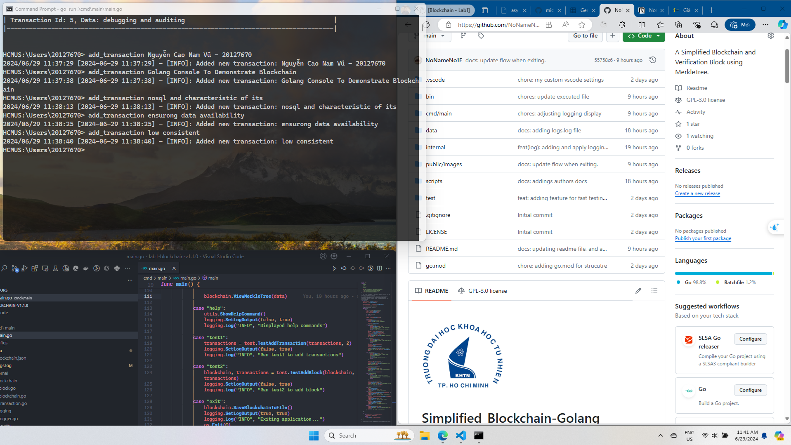

<div aligns="center">

  
  <h1>Simplified_Blockchain-Golang</h1>
A Simplified Blockchain and Verification Block using MerkleTree.
  <p>
    This is project about implementation of Blockchain and Verification Block using MerkleTree which is written in Golang.
  </p>
   <p>
     Author: Nguyễn Cao Nam Vũ - 20127670
  </p>
  <p>
    Golang Console To Demonstrate Blockchain
  </p>

<p>
  <a href="https://github.com/NoNameNo1F/Simplified_Blockchain-Golang/graphs/contributors">
    
  </a>
  <a href="">
    
  </a>
  <a href="https://github.com/NoNameNo1F/Simplified_Blockchain-Golang/network/members">
    
  </a>
  <a href="https://github.com/NoNameNo1F/Simplified_Blockchain-Golang/stargazers">
    
  </a>
  <a href="https://github.com/NoNameNo1F/Simplified_Blockchain-Golang/issues/">
    
  </a>
  <a href="https://github.com/NoNameNo1F/Simplified_Blockchain-Golang/blob/master/LICENSE">
    
  </a>
</p>

<h4>
    <a href="https://github.com/NoNameNo1F/Simplified_Blockchain-Golang/">View Demo</a>
  <span> · </span>
    <a href="https://github.com/NoNameNo1F/Simplified_Blockchain-Golang/">Documentation</a>
  <span> · </span>
    <a href="https://github.com/NoNameNo1F/Simplified_Blockchain-Golang/issues/">Report Bug</a>
  <span> · </span>
    <a href="https://github.com/NoNameNo1F/Simplified_Blockchain-Golang/issues/">Request Feature</a>
  </h4>
</div>

# :notebook_with_decorative_cover: Table of Contents

1. [About the Project](#about-the-project)
2. [How It Works](#how-it-works)
3. [Explain Functions](#explain-functions)
4. [Tech Stack](#tech-stack)
5. [Key Features](#key-features)
6. [Getting Started](#getting-started)
   - [Prerequisites](#prerequisites)
   - [Installation](#installation)
   - [Usage](#usage)
7. [Contributing](#contributing)
8. [License](#license)
9. [Contact](#contact)
10. [Acknowledgements](#acknowledgements)
11. [Documentation](#documentation)

# :star2: About the Project

This project is a simple implementation of a blockchain in Go. It allows users to interact with the blockchain through a command-line interface (CLI). Users can add transactions, create blocks, verify blocks, view transactions, and more. The project also includes a basic logging mechanism to track operations and events.

## :dart: Key Features

- [x] View the entire blockchain
- [x] Add transactions
- [x] Add block
- [x] Verify block by MerkleRoot
- [x] View current transactions
- [x] View the Merkle tree of specific block
- [x] Test functionalities

## :camera: Screenshots

### :Workflows

<div aligns="center">
  
</div>

### View Blockchain

<div aligns="center">
  
</div>

### Add Transaction

<div aligns="center">
  
</div>

### Add Block

<div aligns="center">
  
</div>

### Verify Block

<div aligns="center">
  
</div>

### View Transactions

<div aligns="center">
  
</div>

### Print MerkleTree

<div aligns="center">
  
</div>


## :toolbox: Getting Started

### :bangbang: Prerequisites

- Go 1.20 or higher

### :running: Installation

1. Clone the repository:

   ```sh
   git clone https://github.com/NoNameNo1F/Simplified_Blockchain-Golang.git
   cd Simplified_Blockchain-Golang
   ```

2. Build the project:

   ```sh
   go build -o ./bin/blockchain.exe ./cmd/main/main.go
   ```

### :eyes: Usage

1. Run the application:
    a. Run with the output file (.exe)

   ```sh
   ./bin/blockchain.exe
   ```
    b. Run with Go Run

    ```sh
    go run ./cmd/main/main.go
    ```

    c. Run Multiple Console in Windows

    ```sh
    ./scripts/blockchain.bat
    ```

2. Use the CLI commands:
   - `view_blockchain`: Displays the entire blockchain.
   - `add_transaction {message}`: Adds a new transaction.
   - `add_block`: Adds a block with the current transactions.
   - `verify_block {hash_of_merkle_root}`: Verifies a block by its Merkle root hash.
   - `view_transactions`: Views the current transactions.
   - `print_merkletree {hash_of_merkle_root}`: Prints the Merkle tree of a specific block.
   - `help`: Displays the help commands.
   - `test1`: Adds test transactions for fast add_transactions.
   - `test2`: Adds a test block for fast add_block into blockchain.
   - `exit`: Exits the application.

## Folder Structure
---

```shell
Simplified_Blockchain_Golang/
├── bin
│   └── blockchain.exe
│
├── cmd
│   └── main
│       └── main.go
│
├── data
│   └── blockchain.json
│
├── internal
│   ├── blockchain
│   │   ├── block.go
│   │   ├── blockchain.go
│   │   └── transaction.go
│   │
│   ├── logging
│   │   └── logging.go
│   │
│   ├── security
│   │   └── merkletree.go
│   │
│   ├── utils
│   │   ├── commands.go
│   │   └── helpers.go
│   │
│   ├── scripts
│   │   └── blockchain.bat
│   │
│   ├── test
│   │   └── test.go
│   │
│   └──go.mod
│
└── public
    └── images
        └── ...
```

# How It Works

The project is structured around several key components:

- **Main Application**: The entry point of the program where it interacts with the blockchain through user commands.
- **Blockchain**: Manages the collection of blocks and transactions.
- **Blocks**: Each block contains a set of transactions, a timestamp, a hash of the previous block, and a Merkle root.
- **Transactions**: Represents individual transactions in the blockchain.
- **Merkle Tree**: A data structure used to verify the integrity of the transactions in a block.
- **Logging**: Records important events and operations for debugging and auditing purposes.

## Explain Functions

### main.go

- **main**: Entry point of the program. Handles user commands and interacts with the blockchain.

### block.go

- **NewBlock**: Creates a new block with transactions and the hash of the previous block.
- **CalculateHash**: Calculates the hash of the block.
- **GetHashTransactions**: Returns the hashes of the transactions in the block.
- **HashTransactions**: Calculates the hash of all the transactions in the block.
- **CalculateMerkleRoot**: Calculates the Merkle root of the transactions in the block.
- **Verify**: Verifies if the Merkle root matches the calculated Merkle root.
- **ShowMerkleTree**: Displays the Merkle tree of the block.

### blockchain.go

- **NewBlockchain**: Creates a new blockchain with an initial block.
- **LoadBlockchain**: Loads the blockchain data from a file.
- **SaveBlockchainToFile**: Saves the blockchain data to a file.
- **InitBlock**: Creates the initial block.
- **AddBlock**: Adds a new block to the blockchain.
- **GetTransactions**: Returns the transactions of the latest block.
- **ViewBlockchain**: Prints the blockchain.
- **GetLatestBlock**: Returns the latest block in the blockchain.
- **VerifyBlock**: Verifies if a block's transactions are valid based on its Merkle root hash.
- **ViewMerkleTree**: Displays the Merkle tree of a specific block.
- **FetchingDatabase**: Continuously loads the blockchain and sends it through a channel.

### transaction.go

- **CreateTransaction**: Creates a new transaction.
- **ViewTransactions**: Prints a list of transactions.

### logger.go

- **Log**: Logs a message with a timestamp and log type.

### merkletree.go

- **CreateMerkleNode**: Creates a new Merkle node.
- **CreateMerkleTree**: Creates a Merkle tree from an array of data.

### commands.go

- **ShowHelpCommand**: Displays the help commands for the application.

### helpers.go

- **IntToHex**: Converts an integer to its hexadecimal representation.
- **GenerateSpacing**: Generates a string of spaces with a specified size.
- **GetPath**: Returns the absolute path of a given path.
- **GetFileByExtens**: Retrieves the file with the specified extension in a given folder.

### tests.go

- **TestAddTransaction**: Adds a specified number of test transactions.
- **TestAddBlock**: Adds a test block to the blockchain.

## Tech Stack

- Go: The main programming language used for this project.

## :wave: Contributing

<a href="https://github.com/NoNameNo1F/Simplified_Blockchain-Golang/graphs/contributors">
  
</a>

Contributions are welcome! Please fork the repository and submit a pull request.

## :warning: License

This project is licensed under the GPL-3.0-version License. See the [LICENSE](LICENSE) file for details.

## :handshake: Contact

Nguyễn Cao Nam Vũ - [Linkedin](linkedin.com/in/vu-nguyen-a61a83235) - NoNameNo1F@gmail.com

Project Link: [https://github.com/NoNameNo1F/Simplified_Blockchain-Golang](https://github.com/NoNameNo1F/Simplified_Blockchain-Golang)

For questions or inquiries, please contact:
- Vu Nguyen Cao Nam: [NoNameNo1F@gmail.com](mailto:NoNameNo1F@gmail.com) || [vunguyencaonam@gmail.com](mailto:vunguyencaonam@gmail.com)
- GitHub: [NoNameNo1F](https://github.com/NoNameNo1F)

## :gem: Acknowledgements

- Special thanks to the contributors and community members for their support and contributions.

## :book: Documentation

- [Devdocs-Go](https://devdocs.io/go/)
- [MerkleTree Illustration](https://blockchain-academy.hs-mittweida.de/merkle-tree/)
- [Blockchain Abstract Structure](https://www.researchgate.net/figure/The-structure-of-a-Blockchain-A-block-is-composed-of-a-header-and-a-body-where-a-header_fig1_337306138)
- [MerkleTree-Details](https://www.geeksforgeeks.org/blockchain-merkle-trees/)
- [Golang Folder Structure](https://github.com/golang-standards/project-layout)
